# CREACION DE UN REPO Y ENLAZARLO CON GITHUB

<image src="https://play-lh.googleusercontent.com/PCpXdqvUWfCW1mXhH1Y_98yBpgsWxuTSTofy3NGMo9yBTATDyzVkqU580bfSln50bFU" width="100px" heigth="100px">

## Descripción

Este **README** nos ayudara a la creacion de un repositorio en **GitHub** y conectarlo con una carpeta que se desee subir al mismo.

*Para mayor información y más detallado, puede visualizar el siguiente enlace*
[https://www.hostinger.co/tutoriales/comandos-de-git]

## Contenido
    1. Creación Repositorio en GitHub.
    2. Obtener Url del Repositorio Remoto.
    3. Abrir Git Bash en la carpete a subir.
    4. Ejecución de comando.
    5. Recarga de pagina en GitHub.

## Instrucciones

**1**. Creación de un Repositorio en GitHub!:

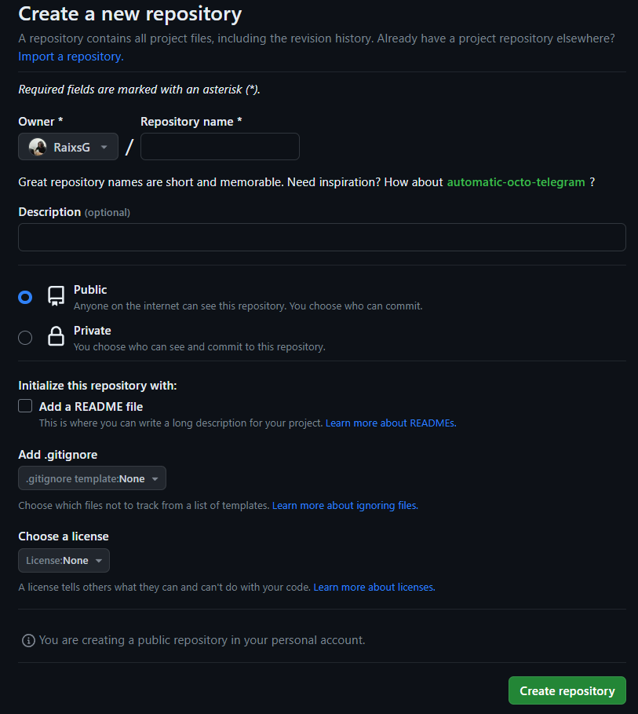

De preferencia que el nombre sea igual que la carpeta que vaya a subir al repositorio.

**2**. Luego de Crear el repositorio en GitHub, copias el codigo Url que te da de resultado.
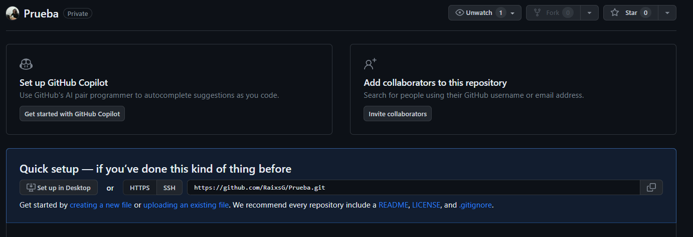

**3**. En tu carpeta local abre una terminal, o abre el Git Bash!:
      (Con MAYUS + Click Derecho) puedes abrir el panel completo si en caso estas en Windows 11.
      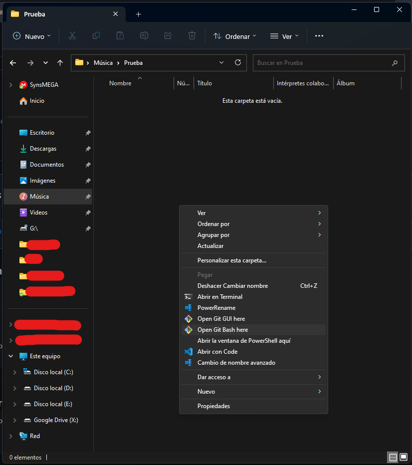

      { Por parte de la prueba voy a crear un archivo .txt }

**4**. Ahora dentro del Git Bash ejecuta los siguientes comandos:

    **4.1**.'git init'
        *[Esto iniciara un nuevo repositoro en el lugar ejecutado]*
        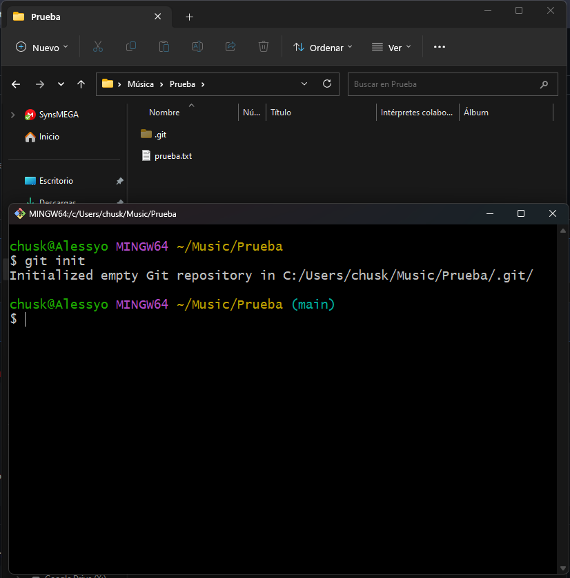
        *[Esto nos dejara con un archivo .git en la carpeta]*
        
    **4.2**.'git add .'
        *[Con este comando, se agregaran TODOS los ARCHIVOS a la "cola" para enviarse al repositorio]*
        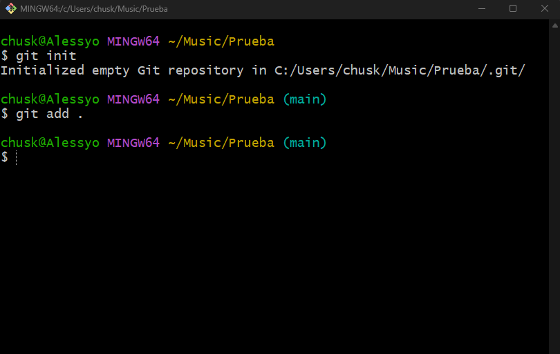
        *[Si en caso desea ver la cola a enviarse, ejecute el siguiente comando]*
        *4.2.1*.[git status]
            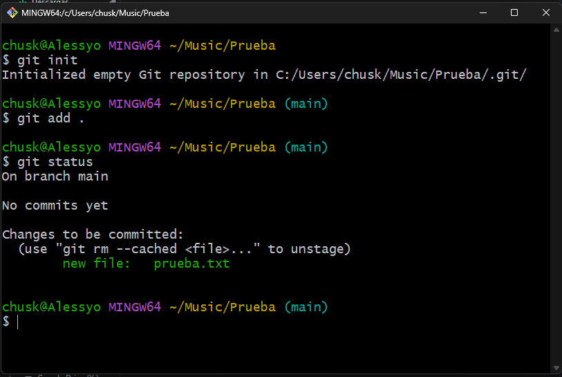
              *[Como puede visualizar, esta en cola un nuevo archivo (que seria nuestro archivo .txt)]*
              
    **4.3**.'git commit -m "mensaje a enviar"
        *[Los cambios ya estan agregados, solo faltaria realizar el push hacia el repositorio Remoto]*
        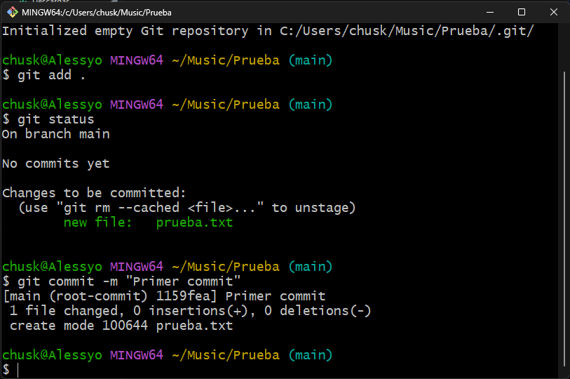
        *[Si quiere visualizar el estado de los archivos, nuevamente puede ejecutar el anterior comando]*
        *4.3.1*.[git status]
            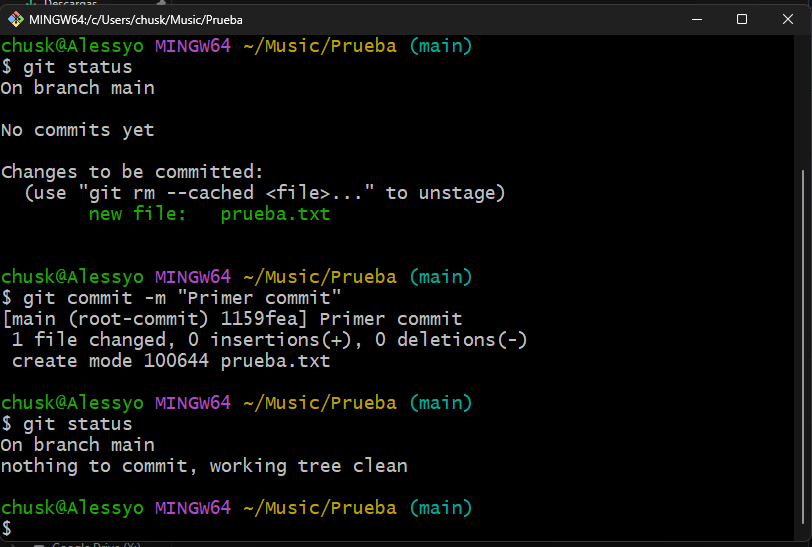
              *[Se puede ver que no hay ningun Commit en cola]*
              
    **4.4**.'git remote add origin https://aqui-va-su-link.git'
        *[Con esto, sus archivos se van a conectar con su repositorio remoto dentro GitHub]*
        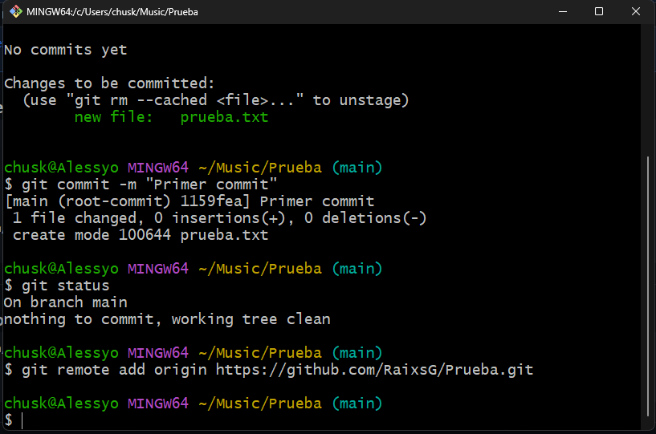
        
    **4.5**.'git push origin main'
        *[Por ultimo, ejecutaremos este comando, lo que hará que se suban completamente todos sus archivos selecionados a su*
        *repositorio remoto]*
        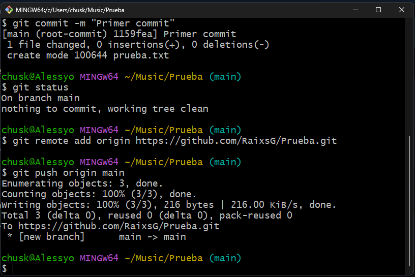
        *4.5.1*.[git status]
              *[Ahora si desea, pueden comprobar el estados de sus archivos con el anterior comando]*
            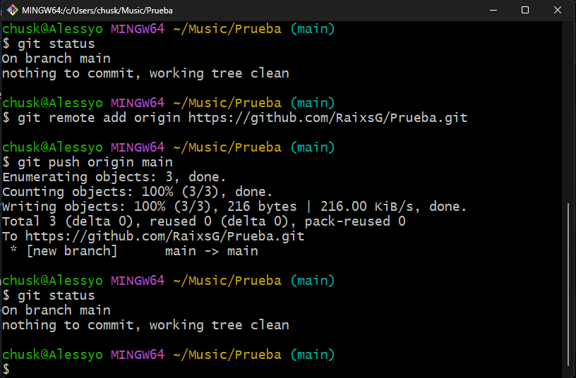

**5**.Si volvemos a nuestro GitHub, y recargamos la pagina podremos visualizar nuestros archivos que hemos subido.
    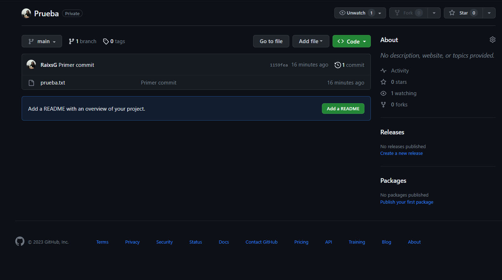
